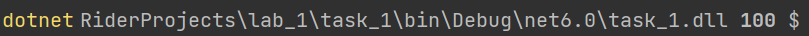
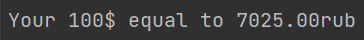

*Выполнила Галиева Г.Р. БСБО-05-19*
## Краткое писание
***
Приложение написано на языке программирования С#.

В приложении выполняется два условия:
1) Аргументы передаваемые в приложение передаются динамически пользователем. Они задаются в командной строке при запуске.
2) Вывод результата работы программы перенаправляется и записывается в файл при запуске с командной строки.

Сборка проекта производится средствами CI, конфигурация указана в файле `.gitlab-ci.yml`. В данном файле также задаётся переменная `$MONEY`. В ней записаны сумма денег и валюта, которые нужно конвертировать. Данные о валюте записываются через пробел в формате `rub` или `$`. Например, `100 rub`.  

## Скриншоты
***
#### Запуск программы с переданнными аргументами

#### Вывод программы

